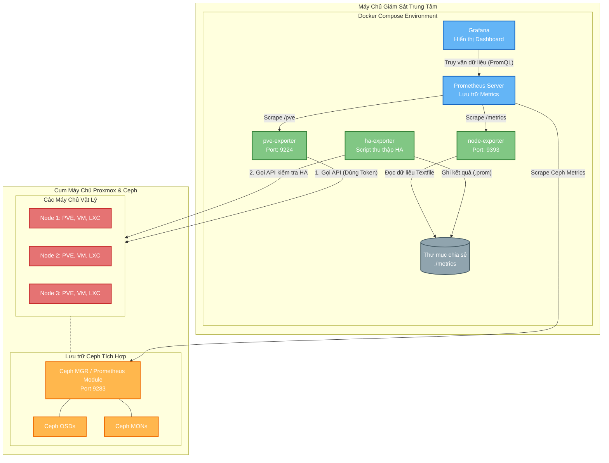

# 🚀 Hệ Thống Giám Sát Proxmox & Ceph HA (Enterprise Edition)

Hệ thống giám sát toàn diện cho cụm máy chủ Proxmox, bao gồm các thành phần:
1. **Proxmox Metrics (PVE Exporter)**: Giám sát tài nguyên máy ảo (VM), LXC, Storage, Node.
2. **Ceph Metrics**: Giám sát sức khỏe, dung lượng và hiệu năng của hệ thống lưu trữ phân tán Ceph.
3. **Proxmox HA Metrics (Custom Script)**: Giám sát trạng thái của các nhóm High Availability.
4. **Host Metrics (Node Exporter)**: Giám sát tài nguyên phần cứng vật lý.

---

## 1. Yêu Cầu Chuẩn Bị
- Máy chủ đã cài đặt Docker và Docker Compose.
- Hệ thống Ceph trên Proxmox (Được tích hợp sẵn).
- Token API của Proxmox (Có quyền `PVEAuditor` hoặc cao hơn). 

**Cách tạo Token trên Proxmox:**
1. Đăng nhập vào giao diện web Proxmox.
2. Truy cập **Datacenter** -> **Permissions** -> **API Tokens**.
3. Bấm **Add**, chọn User (vd: `root@pam`), điền Token ID (vd: `monitor-grafana`), bỏ tick phần *Privilege Separation* (hoặc gán quyền `PVEAuditor` nếu bảo mật cao).
4. Bấm **Add** và lưu lại chuỗi **Secret** (Đây chính là `token_value`).

---

## 2. Kích Hoạt Ceph Exporter (Trên máy chủ Proxmox)
Hệ thống Ceph trên Proxmox đã tích hợp sẵn module xuất metrics (số liệu) cho Prometheus nhưng mặc định bị tắt. Để lấy đủ số liệu (sức khỏe, IOPS, băng thông, OSD, Pool...), bạn SSH vào máy chủ Proxmox và chạy tuần tự các lệnh sau:

```bash
# 1. Bật module Prometheus trên Ceph Manager
ceph mgr module enable prometheus

# 2. Lắng nghe trên mọi IP (Bắt buộc nếu Prometheus nằm ở máy chủ khác)
ceph config set mgr mgr/prometheus/server_addr 0.0.0.0

# 3. Đảm bảo cổng hoạt động (Mặc định là 9283)
ceph config set mgr mgr/prometheus/server_port 9283

# 4. (Tuỳ chọn) Bật thu thập metrics chi tiết cho các Pool RBD nếu bạn dùng RBD
ceph config set mgr mgr/prometheus/rbd_stats_pools "*"

```
Sau khi chạy xong, Ceph sẽ mở port `9283` trên máy chủ đang giữ quyền Manager (MGR). Bạn có thể đứng ở máy khác và kiểm tra thử bằng lệnh: `curl http://<IP_PROXMOX_MGR>:9283/metrics`

---

## 3. Tải Code và Cài Đặt Tự Động (Setup Script)
Để mọi thứ đơn giản và nhanh gọn nhất, một kịch bản cài đặt tự động (`setup-proxmox-ceph-deco-dms.sh`) đã được tạo sẵn để tự động hóa toàn bộ quá trình kiểm tra môi trường, tạo file cấu hình và khởi động Docker.

**Vị trí chạy lệnh:** Tại máy chủ trung tâm giám sát (Nơi bạn dùng để cài Docker/Prometheus, **không** phải chạy trên máy chủ Proxmox).

### Các bước thực hiện:

**Bước 1: Tải bộ source code này về máy chủ**
Mở Terminal (Linux/Ubuntu/CentOS) và chạy lệnh sau để tải toàn bộ code từ GitHub về:
```bash
git clone https://github.com/fixnhanh-linux/proxmox-ceph-ha-monitoring.git
cd proxmox-ceph-ha-monitoring
```

**Bước 2: Cấp quyền thực thi cho file script**
```bash
chmod +x setup-proxmox-ceph-deco-dms.sh
```

**Bước 3: Chạy kịch bản cài đặt**
```bash
./setup-proxmox-ceph-deco-dms.sh
```

**Kịch bản xảy ra khi chạy lần đầu:**
- Script sẽ báo lỗi `⚠️ Không tìm thấy file proxmox_credentials.yml` và nó sẽ **tự động tạo ra 1 file mẫu** cho bạn.
- Bạn cần mở file `proxmox_credentials.yml` vừa được tự động sinh ra đó, điền đúng cái Token mà bạn đã tạo ở **Mục 1** vào dòng `token_value: ...`
- Sau khi điền xong và lưu lại file, bạn chạy lệnh `./setup-proxmox-ceph-deco-dms.sh` lại một lần nữa.
- Lần này script sẽ báo Xanh (✅) toàn bộ và gọi `docker-compose` để tải Image và khởi động 3 container chạy nền (pve-exporter, node-exporter, ha-exporter).

> **Lưu ý cực hay:** Nhờ cơ chế **Auto-Discovery** chạy ngầm bên trong, hệ thống sẽ tự động bắt lấy danh sách IP của tất cả máy chủ vật lý Proxmox của bạn và tự sinh ra các file `proxmox_targets.json` và `ceph_targets.json` ném vào thư mục `./metrics`. Nhiệm vụ của Prometheus là chỉ việc đứng đọc các file JSON đó!
- **`pve-exporter`**: (Port 9224) Đọc token và thu thập thông tin tài nguyên PVE.
- **`ha-exporter`**: (Không có port) Chạy script tùy chỉnh tự động gọi API lấy metrics HA và ghi ra thư mục dùng chung `./metrics`.
- **`node-exporter`**: (Port 9393) Thu thập metrics HA từ thư mục `./metrics` và phục vụ ra ngoài.

---

## 4. Cấu Hình Prometheus (`prometheus.yml`)
Trong file cấu hình của máy chủ Prometheus, bạn cần định nghĩa 3 công việc (Jobs) riêng biệt để gom toàn bộ dữ liệu về. Mở file `prometheus.yml` và thêm vào phần `scrape_configs`:

```yaml
scrape_configs:
  # ====================================================================
  # 1. Job thu thập thông tin Máy ảo, Node, Storage (PVE Exporter)
  # ====================================================================
  - job_name: 'proxmox'
    metrics_path: /pve
    file_sd_configs:
      - files:
        - '/etc/prometheus/metrics/proxmox_targets.json'  # <-- Đảm bảo thư mục metrics được mount vào Prometheus
    relabel_configs:
      - source_labels: [__address__]
        target_label: __param_target
      - source_labels: [__param_target]
        target_label: instance
      - target_label: __address__
        replacement: 10.8.10.201:9224 # <-- THAY BẰNG IP CỦA MÁY CHẠY DOCKER-COMPOSE CỦA BẠN

  # ====================================================================
  # 2. Job thu thập thông tin lưu trữ phân tán Ceph
  # ====================================================================
  - job_name: 'ceph'
    file_sd_configs:
      - files:
        - '/etc/prometheus/metrics/ceph_targets.json'

  # ====================================================================
  # 3. Job thu thập thông tin High Availability (HA)
  # ====================================================================
  - job_name: 'node_exporter_ha' # Thu thập số liệu HA từ script shell chạy ngầm
    static_configs:
      - targets:
        # Gọi thẳng vào container node-exporter đang chạy trên Docker (Cổng 9393)
        - '10.8.10.201:9393'     # <-- THAY BẰNG IP CỦA MÁY CHẠY DOCKER-COMPOSE CỦA BẠN
```
*Lưu ý: Thay thế các địa chỉ IP bằng cấu hình mạng thực tế của bạn.* Sau đó, khởi động lại Prometheus để áp dụng thay đổi.

---

## 5. Cài Đặt Grafana Dashboard (Sử dụng Template JSON)
Tất cả các biểu đồ chuyên sâu đã được đóng gói sẵn trong file template JSON đi kèm. Để sử dụng:
1. Đăng nhập vào Grafana của bạn.
2. Di chuột vào icon dấu `+` (Hoặc mục **Dashboards**) -> Chọn **Import**.
3. Bấm **Upload JSON file** và chọn file:
   `Grafana_Dashboard_Proxmox_Ceph_HA_Monitoring.json`
4. Ở màn hình cấu hình, chọn đúng nguồn dữ liệu (Data Source) là kho `Prometheus` của bạn.
5. Bấm **Import** và hoàn tất!

Bạn sẽ thấy một bảng điều khiển (Dashboard) trung tâm cực kỳ chi tiết bao gồm trạng thái sức khỏe Cluster, Máy ảo, Lưu trữ Ceph, và tính sẵn sàng cao (HA).

---

## 6. Hướng Dẫn Điều Chỉnh Dashboard (Trường hợp "No Data")
Đôi khi sau khi Import Dashboard, biểu đồ có thể báo "No Data" (Không có dữ liệu). Nguyên nhân thường là do tên Job, tên Cluster hoặc cấu trúc Label trong cơ sở dữ liệu Prometheus của bạn không khớp 100% với những gì người tạo Dashboard đã viết sẵn. Dưới đây là các bước khắc phục chi tiết nhất:

### 6.1. Xử lý lỗi do biến số (Dashboard Variables) bị sai
Các Dashboard chuyên nghiệp thường dùng biến (Dropdown menu ở trên cùng màn hình) như `$job`, `$node`, `$cluster`. Nếu các biến này không tải được dữ liệu, toàn bộ biểu đồ bên dưới sẽ sụp đổ.
1. Nhìn lên góc trên cùng bên phải Dashboard, bấm vào icon bánh răng **Dashboard settings**.
2. Chọn menu **Variables** ở thanh bên trái.
3. Bấm vào từng biến đang bị lỗi (không xổ ra được danh sách).
4. Cuộn xuống phần **Query Options** -> **Query**:
   - Trực tiếp sửa câu lệnh truy vấn. Ví dụ nếu câu lệnh cũ là `label_values(pve_version_info, job)`, nhưng bạn lại đang dùng job tên khác, hãy đổi nó thành `label_values(job)`. Hoặc nếu biến `cluster` đang dùng `label_values(ceph_health_status, cluster)`, hãy đảm bảo metric `ceph_health_status` của bạn có tồn tại label `cluster`.
5. Sau khi sửa, nhìn xuống phần **Preview of values** ở dưới cùng. Nếu bạn thấy nó hiện ra danh sách chữ (ví dụ: `proxmox`, `ceph`, `my-cluster`) thì nghĩa là bạn đã sửa đúng!
6. Bấm nút **Update**, sau đó quay lại màn hình Settings.

### 6.2. Sửa biểu đồ (Panel) bị gắn cứng tên Job/Label
Nếu các biến ở trên (Variables) đã nhận đúng, nhưng lác đác vài biểu đồ vẫn "No Data", nghĩa là tác giả đã hardcode (gắn cứng) một giá trị nào đó trong câu truy vấn.
1. Di chuột vào tên của biểu đồ bị lỗi, bấm dấu 3 chấm `...` -> Chọn **Edit**.
2. Nhìn xuống mục **Metrics browser** (nơi chứa câu lệnh Query bắt đầu bằng chữ `expr:`).
3. Đọc kỹ câu lệnh đó và tìm các đoạn nằm trong cặp ngoặc nhọn `{...}`.
   - *Ví dụ 1 (Sai tên Job):* Biểu đồ ghi `ceph_osd_up{job="ceph-metrics"}` nhưng job của bạn tên là `ceph` -> Đổi lại thành `ceph_osd_up{job="ceph"}` hoặc dùng biến động `ceph_osd_up{job="$job"}`.
   - *Ví dụ 2 (Thiếu Label cluster):* Biểu đồ ghi `ceph_health_status{cluster="ceph"}` nhưng cấu hình Prometheus của bạn không có label `cluster` nào cả -> Xóa luôn đoạn `cluster="ceph"` đi thành `ceph_health_status{}`.
4. Ngay khi bạn sửa đúng, màn hình đồ thị ở phía trên sẽ lập tức nhảy số liệu (không cần lưu lại mới thấy).
5. Bấm **Apply** ở góc trên cùng bên phải để đóng giao diện Edit lại.

### 6.3. Mẹo gỡ rối nhanh (Dùng công cụ Explore)
Nếu bạn vẫn không biết mình viết sai ở đâu, hãy dùng tính năng Explore của Grafana:
1. Bấm vào icon la bàn (Explore) ở thanh menu dọc bên trái ngoài cùng của Grafana.
2. Chọn Data Source là Prometheus.
3. Ở ô gõ lệnh, hãy gõ thử một metric cơ bản, ví dụ: `pve_version_info` hoặc `ceph_health_status` rồi ấn `Shift + Enter`.
4. Nhìn vào kết quả trả về ở bảng bên dưới. Nó sẽ hiện **CHÍNH XÁC cấu trúc Label** mà hệ thống bạn đang có (ví dụ: nó sẽ ghi rõ `job="proxmox", instance="10.8.10.21:9224"`).
5. Hãy copy chính xác cụm label đó nhét ngược lại vào câu lệnh Query của cái biểu đồ đang bị lỗi. Chắc chắn 100% biểu đồ sẽ lên hình!

*Đừng quên bấm icon **Save** (biểu tượng đĩa mềm) ở góc trên Dashboard sau khi đã sửa xong tất cả để lưu lại vĩnh viễn cấu hình này nhé!*

---

## 7. Sơ Đồ Kiến Trúc Hệ Thống (Architecture Diagram)

Dưới đây là sơ đồ chi tiết về luồng hoạt động và cách các thành phần trong hệ thống giám sát tương tác với nhau:



---

## 8. Bảng Tra Cứu Chỉ Số Trọng Yếu (Metrics Catalog)

Dưới đây là danh sách các Metrics (chỉ số) quan trọng nhất được thu thập bởi hệ thống, giúp bạn dễ dàng viết thêm các câu lệnh PromQL tùy chỉnh cho Grafana hoặc Alertmanager.

### 8.1. Ceph Storage Metrics
Các chỉ số từ cụm lưu trữ phân tán Ceph:

| Metric | Mô tả | Đơn vị / Trạng thái |
|--------|-------|---------------------|
| `ceph_health_status` | Trạng thái sức khỏe cụm Ceph | `0`: OK, `1`: WARN, `2`: ERR |
| `ceph_osd_up` | Số lượng OSD đang chạy (up) | Count (Số lượng) |
| `ceph_osd_in` | Số lượng OSD nằm trong CRUSH Map | Count (Số lượng) |
| `ceph_cluster_total_bytes` | Tổng dung lượng của toàn bộ cụm Ceph | Bytes |
| `ceph_cluster_total_used_bytes` | Dung lượng Ceph đã sử dụng | Bytes |
| `rate(ceph_osd_op_r[1m])` | Tốc độ đọc (Read IOPS) | IOPS |
| `rate(ceph_osd_op_w[1m])` | Tốc độ ghi (Write IOPS) | IOPS |
| `rate(ceph_osd_op_r_out_bytes[1m])` | Băng thông đọc (Read Bandwidth) | Bytes/sec |
| `rate(ceph_osd_op_w_in_bytes[1m])` | Băng thông ghi (Write Bandwidth) | Bytes/sec |
| `ceph_pool_bytes_used` | Dung lượng đã sử dụng của từng Pool | Bytes |

### 8.2. Proxmox Virtual Environment (PVE) Metrics
Các chỉ số liên quan đến tài nguyên vật lý và máy ảo trên Proxmox:

| Metric | Mô tả | Đơn vị / Trạng thái |
|--------|-------|---------------------|
| `pve_node_up` | Trạng thái hoạt động của các Node PVE | `1`: Up, `0`: Down |
| `pve_guest_status` | Trạng thái của VM/LXC (running, stopped) | `1`: Running, `0`: Stopped |
| `pve_node_cpu_usage` | % CPU đang sử dụng của Node vật lý | Ratio (0.0 - 1.0) |
| `pve_node_memory_total` | Tổng RAM của Node vật lý | Bytes |
| `pve_node_memory_used` | RAM đang sử dụng của Node vật lý | Bytes |
| `pve_guest_cpu_usage` | % CPU đang sử dụng của từng VM/LXC | Ratio (0.0 - 1.0) |
| `pve_guest_memory_used` | RAM đang sử dụng của từng VM/LXC | Bytes |
| `pve_storage_total` | Tổng dung lượng của các Storage (local, lvm, rbd...) | Bytes |
| `pve_storage_used` | Dung lượng đã dùng của các Storage | Bytes |
| `pve_version_info` | Thông tin phiên bản PVE đang chạy | Text / Label |

### 8.3. Proxmox High Availability (HA) Metrics
Các chỉ số trạng thái High Availability được thu thập thông qua script tùy chỉnh:

| Metric | Mô tả | Đơn vị / Trạng thái |
|--------|-------|---------------------|
| `pve_ha_group_status` | Trạng thái của các HA Group | `1`: OK, `0`: Error |
| `pve_ha_resource_status` | Trạng thái HA của từng Resource (VM/LXC) | `1`: Started, `0`: Stopped/Error |
| `pve_ha_manager_status` | Trạng thái tiến trình LRM/CRM manager | `1`: Active, `0`: Inactive |
